I build **production systems for education and organizational operations** — multi-tenant SaaS, REST APIs with strict role-based access control, and automation that replaces manual spreadsheet work with auditable software.

> [!IMPORTANT]
> 🔭 **Building now — [Leora School Assistant](https://github.com/Claytonee/Leora-School-Assistant-Showcase)**: a multi-tenant school-management SaaS designed for **100+ Tanzanian secondary schools** — NECTA-aligned grading, TIE-aligned curriculum, finance & billing, attendance, discipline and parent communication in one platform.
> **252 database models · 500+ API route handlers · 390+ pages** (Next.js 16, TypeScript, PostgreSQL, Prisma).

## 🏫 Where I've shipped

| | Role | What I delivered |
|---|---|---|
| **Opportunity Education Tanzania** (2026) | Software Developer · PNDT | Shipped the **[Technical Support System](https://github.com/Claytonee/Technical-Support-System)** to production — the single channel **36 partner schools** use to report and resolve ICT faults. Automated 4-tier SLA engine (critical ≤ 2 h → low ≤ 72 h) with breach detection, 4-tier RBAC across **112 REST endpoints / 23 PostgreSQL tables**, tablet-fleet registry with audit trails. Also delivered **Partner360**, a 43-model platform digitizing the school-partnership lifecycle, and a typed 21-criteria school-readiness scoring engine. |
| **EnterSoft Systems Ltd** (2024–2025) | Software Developer | Custom web applications delivered end to end — requirements, build, testing, handover — plus ICT consultancy on technology integration and system optimization for client businesses. |

## ⚙️ Tech stack

`LLM integration (multi-provider failover)` · `Google Apps Script + clasp` · `Cloudinary CDN` · `cPanel / DirectAdmin` · `Render` · `CI checks` · `audit logging`

## 🧩 Featured repositories

| Repository | What it demonstrates |
|---|---|
| **[Leora-School-Assistant-Showcase](https://github.com/Claytonee/Leora-School-Assistant-Showcase)** | Architecture & module deep-dive of the multi-tenant school SaaS (proprietary codebase — technical overview) |
| **[Technical-Support-System](https://github.com/Claytonee/Technical-Support-System)** | Production support platform for 36 schools: SLA engine, RBAC, escalation chains, audit trails |
| **[pharma-project](https://github.com/Claytonee/pharma-project)** | Django 5 + PostgreSQL pharmacy management system with PDF/Excel reporting and digitally signed documents |
| **[Rental-Management-System](https://github.com/Claytonee/Rental-Management-System)** | Rental platform for Moshi, Tanzania — user & item management, TZS payments via Stripe |

## ⚡ ASCII showreel

A motion experiment from my lab — real footage of a student mid-run, turned into a living field of characters where light alone decides which glyphs glow.

  

## 🎯 How I work

- **Multi-tenancy done properly** — every query scoped by tenant; every role sees exactly the schools and records it is permitted to see, and nothing more.
- **Auditability** — audit logs, SLA breach detection, and every applicant scored on identical, auditable criteria instead of hand-maintained spreadsheet formulas.
- **Built for Tanzania** — NECTA-aligned grading, TIE-aligned curriculum, TZS payments, and offline/LAN content delivery for low-connectivity schools.

## 🐍 Contribution graph

<picture>
  <source media="(prefers-color-scheme: dark)" srcset="./assets/github-contribution-grid-snake-dark.svg"/>
  <source media="(prefers-color-scheme: light)" srcset="./assets/github-contribution-grid-snake.svg"/>
  
</picture>

## 📫 Reach me

> **© 2026 Claytone Curthberth Mhina · Leora Tech Solutions. All rights reserved.** The artwork, animated banners and text on this profile may not be copied, modified or redistributed without written permission.
